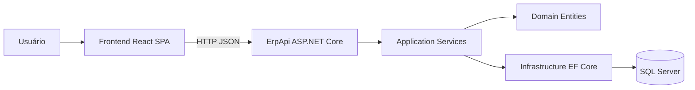
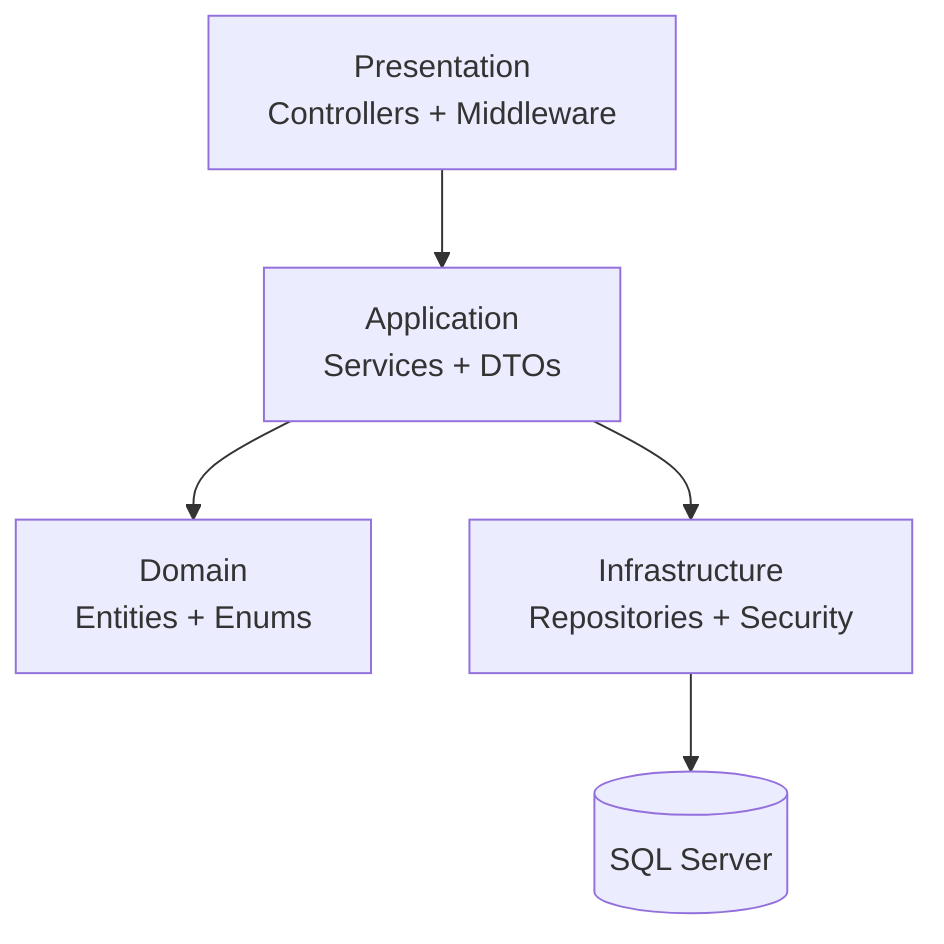
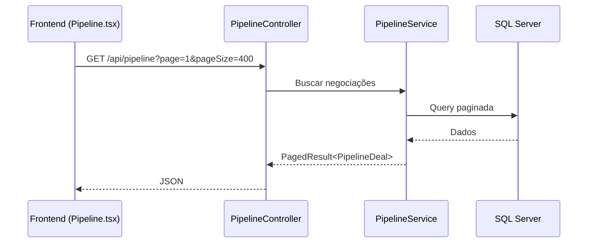

# 🏢 ERP Imobiliário — Portfólio Full Stack

[](./)
[](./Sistema-ERP-Imobili-rio)
[](./ErpApi)
[](./)
[](./ErpApi)

ERP web para gestão imobiliária com foco em operação comercial, pipeline de vendas, contratos, imóveis, clientes e personalização white-label.  
O projeto foi desenhado para demonstrar capacidade de engenharia de software full stack em ambiente realista, incluindo API REST, persistência relacional, frontend moderno, validações, testes e preparo para containerização.

---

## 📌 Sumário

- [Visão geral técnica](#-visão-geral-técnica)
- [Arquitetura da aplicação](#-arquitetura-da-aplicação)
- [Stack tecnológica (com versões)](#-stack-tecnológica-com-versões)
- [Funcionalidades principais](#-funcionalidades-principais)
- [Screenshots](#-screenshots)
- [Instalação passo a passo](#-instalação-passo-a-passo)
- [Exemplos de uso](#-exemplos-de-uso)
- [Estrutura de pastas](#-estrutura-de-pastas)
- [Decisões técnicas](#-decisões-técnicas)
- [Desafios e soluções](#-desafios-e-soluções)
- [Métricas de performance](#-métricas-de-performance)
- [Testes realizados](#-testes-realizados)
- [Deploy e configuração](#-deploy-e-configuração)
- [Contribuição](#-contribuição)
- [Licença](#-licença)

---

## 🔍 Visão geral técnica

Este ERP é composto por dois blocos principais:

- **Frontend SPA** em React + TypeScript para gestão visual e operacional.
- **Backend API REST** em ASP.NET Core + Entity Framework Core para regras de negócio, persistência e integração.

### Objetivos de engenharia

- Oferecer **CRUD completo** de clientes, imóveis, contratos e negociações.
- Garantir **consistência de domínio** com mapeamento de enums e validações.
- Permitir **escalabilidade modular** por camadas (Application/Domain/Infrastructure/Presentation).
- Entregar base pronta para **deploy local e evolução para nuvem**.

---

## 🧭 Arquitetura da aplicação

### Diagrama de alto nível



### Arquitetura interna do backend (Clean Architecture simplificada)



### Fluxo de dados (exemplo: Pipeline)



---

## 🧱 Stack tecnológica (com versões)

### Frontend

- **React** `19.2.4`
- **TypeScript** `~5.9.3`
- **Vite** `8.0.0`
- **React Router DOM** `7.13.1`
- **React Hook Form** `7.71.2`
- **Zod** `4.3.6`
- **Framer Motion** `12.38.0`
- **Recharts** `3.8.0`
- **Tailwind CSS** `4.2.2`
- **Zustand** `5.0.12`
- **Vitest** `4.1.0`
- **ESLint** `9.39.4`

### Backend

- **.NET** `10.0` (TargetFramework `net10.0`)
- **ASP.NET Core** `10.0.5`
- **Entity Framework Core** `10.0.5`
- **EF Core SQL Server** `10.0.5`
- **JWT Bearer** `10.0.5`
- **Swashbuckle.AspNetCore** `10.0.1`
- **Serilog.AspNetCore** `9.0.0`

### Banco e infraestrutura

- **SQL Server** `2022-latest` (imagem Docker oficial)
- **Docker Compose** para orquestração local

---

## ✨ Funcionalidades principais

- 👥 **Gestão de Clientes**: cadastro, listagem, atualização e filtros.
- 🏠 **Gestão de Imóveis**: tipologia, status, preço, atributos e catálogo.
- 📄 **Gestão de Contratos**: vínculo entre cliente/imóvel com status e vigência.
- 📊 **Pipeline Comercial**: etapas de funil com atualização de estágio por drag-and-drop.
- 📈 **Dashboard Operacional**: indicadores agregados consumidos do backend.
- 🎨 **White-Label Settings**: nome da empresa, cor principal e logo persistidos via API.
- 🧰 **Seed automático**: carga inicial de dados após migração para acelerar demonstração.

---

## 🖼️ Screenshots

> Capturas de tela para apresentação visual do produto.


### Sugestão de galeria profissional (recomendado para portfólio)

- Dashboard (KPIs)
- Pipeline Kanban
- Cadastro de Cliente
- Tela de Configurações White-label

---

## ⚙️ Instalação passo a passo

## Pré-requisitos

- **Node.js** 20+
- **npm** 10+
- **.NET SDK** 10+
- **Docker Desktop** (opcional, para SQL Server local)

### 1) Clonar e acessar o repositório

```bash
git clone <url-do-repositorio>
cd ERP-projeto
```

### 2) Subir banco de dados (Docker)

```bash
docker run -e "ACCEPT_EULA=Y" \
  -e "MSSQL_SA_PASSWORD=YourStrong!Passw0rd" \
  -p 1433:1433 \
  -d mcr.microsoft.com/mssql/server:2022-latest
```

### 3) Executar backend

```bash
cd ErpApi
dotnet restore
dotnet run --launch-profile http
```

API local: `http://localhost:5288`  
Swagger (dev): `http://localhost:5288/swagger`

### 4) Executar frontend

```bash
cd ../Sistema-ERP-Imobili-rio
npm install
npm run dev
```

Opcional: defina `VITE_API_BASE_URL` para customizar endpoint.

Exemplo `.env`:

```env
VITE_API_BASE_URL=http://localhost:5288/api
```

---

## 💻 Exemplos de uso

### Consumo da API no frontend (TypeScript)

```ts
const apiBaseUrl =
  (import.meta.env.VITE_API_BASE_URL as string | undefined)?.replace(/\/$/, '') ??
  'http://localhost:5288/api';

export async function getDashboardSummary() {
  const response = await fetch(`${apiBaseUrl}/dashboard/summary`);
  if (!response.ok) throw new Error('Erro ao buscar resumo');
  return response.json();
}
```

### Exemplo de chamada HTTP para criar negociação (cURL)

```bash
curl -X POST "http://localhost:5288/api/pipeline" \
  -H "Content-Type: application/json" \
  -d '{
    "title": "Negociação: Apartamento Centro",
    "clientId": "GUID-DO-CLIENTE",
    "propertyId": "GUID-DO-IMOVEL",
    "value": 450000,
    "stage": "leads",
    "lastInteractionAt": "2026-03-25T10:00:00Z"
  }'
```

### Exemplo de endpoint de resumo (C# Controller)

```csharp
[HttpGet("summary")]
public async Task<IActionResult> GetSummary(CancellationToken cancellationToken)
{
    var summary = await dashboardService.GetSummaryAsync(cancellationToken);
    return Ok(summary);
}
```

---

## 🗂️ Estrutura de pastas

```text
ERP-projeto/
├── ErpApi/
│   ├── Application/      # DTOs, serviços e regras de aplicação
│   ├── Domain/           # Entidades, enums e validações de domínio
│   ├── Infrastructure/   # EF Core, repositórios, segurança/JWT
│   ├── Presentation/     # Controllers e middlewares
│   ├── Migrations/       # Histórico de migrações do banco
│   └── Program.cs        # Bootstrap da aplicação
├── Sistema-ERP-Imobili-rio/
│   ├── src/features/     # Módulos funcionais por domínio de tela
│   ├── src/services/     # Camada de integração HTTP
│   ├── src/store/        # Estado global (Zustand)
│   └── src/test/         # Testes com Vitest + Testing Library
└── docker-compose.yml    # Orquestração local
```

---

## 🧠 Decisões técnicas

- **Clean Architecture no backend** para separar domínio, aplicação, infraestrutura e apresentação.
- **DTOs explícitos e paginação padronizada** (`PagedResult<T>`) para escalabilidade de listagens.
- **Mapeamento de enums textual** (`EnumTextMapper`) para UX em português e consistência de persistência.
- **Frontend orientado a serviços** (`src/services/api.ts`) para desacoplar UI da fonte de dados.
- **Seed automático pós-migration** para ambiente de demonstração reproduzível.
- **CORS restrito a localhost/127.0.0.1** para segurança em desenvolvimento.

---

## 🧩 Desafios e soluções

### 1) Integração frontend ↔ backend sem mocks JSON
- **Desafio:** migrar telas de dados estáticos para API real.
- **Solução:** camada de API centralizada, refatoração das features e normalização de payloads.

### 2) Inconsistência de mapeamento entre UI e enums do domínio
- **Desafio:** divergência de nomenclatura em tipos/status.
- **Solução:** padronização no backend com `EnumTextMapper`.

### 3) CORS em ambiente local com múltiplas portas
- **Desafio:** bloqueios de preflight ao consumir API local.
- **Solução:** política de CORS com validação de origem localhost.

### 4) Dados iniciais para demonstração
- **Desafio:** ambiente vazio após primeira execução.
- **Solução:** execução de migration + seed no startup do backend.

---

## 🚀 Métricas de performance

> Métricas coletadas em ambiente local de desenvolvimento.

- **Build frontend (Vite):** `~1.13s` para `2793 módulos transformados`.
- **Build backend (.NET):** `~12.1s` (restore + build em execução local).
- **Bundle principal frontend:** `~242.67 kB` (arquivo `index-*.js`, sem gzip).
- **Dashboard chunk:** `~380.30 kB` (sem gzip).

### Leitura técnica das métricas

- O build está rápido para ciclo de desenvolvimento.
- Há oportunidade de otimização de bundle por lazy-loading adicional em gráficos e módulos pesados.

---

## ✅ Testes realizados

### Frontend

- `npm run lint` → **sem erros** (warnings de hooks existentes).
- `npm run build` → **sucesso** (TypeScript + Vite).
- `npm run test` → **falha parcial** após refatoração do Pipeline (2 testes falharam em `Pipeline.test.tsx`).

### Backend

- `dotnet build` → **sucesso**.

### Próximos ajustes recomendados de qualidade

- Atualizar `Pipeline.test.tsx` para refletir fluxo assíncrono de carregamento via API.
- Adicionar testes de integração da API (controller + banco em ambiente isolado).

---

## 🌐 Deploy e configuração

### Configuração local atual

- Backend em `http://localhost:5288`
- Frontend em `http://localhost:5173` (porta padrão Vite, pode variar)
- SQL Server em `localhost:1433`

### Variáveis importantes

#### Backend (`appsettings.Development.json`)

- `ConnectionStrings:SqlServer`
- `Jwt:Issuer`
- `Jwt:Audience`
- `Jwt:SecretKey`
- `Jwt:ExpiresInMinutes`

#### Frontend (`.env`)

- `VITE_API_BASE_URL=http://localhost:5288/api`

### Docker Compose

O repositório possui `docker-compose.yml` para banco e backend; a etapa de frontend containerizado pode ser evoluída para pipeline completo CI/CD.

---

## 🤝 Contribuição

Contribuições são bem-vindas para evolução técnica do projeto.

1. Faça um fork
2. Crie uma branch (`feature/minha-feature`)
3. Commit com mensagens claras
4. Abra um Pull Request com contexto técnico

Padrões sugeridos:
- Commits semânticos (`feat:`, `fix:`, `refactor:`, `test:`)
- PRs pequenos e objetivos
- Evidência de validação (lint/build/test)

---

## 📄 Licença

No estado atual, **não há arquivo de licença definido** no repositório.  
Para uso comercial/distribuição, recomenda-se definir formalmente uma licença (ex.: MIT, Apache-2.0 ou licença proprietária).

---

## 🔗 Links relevantes

- [React](https://react.dev/)
- [Vite](https://vite.dev/)
- [ASP.NET Core](https://learn.microsoft.com/aspnet/core)
- [Entity Framework Core](https://learn.microsoft.com/ef/core/)
- [SQL Server on Docker](https://learn.microsoft.com/sql/linux/quickstart-install-connect-docker)
